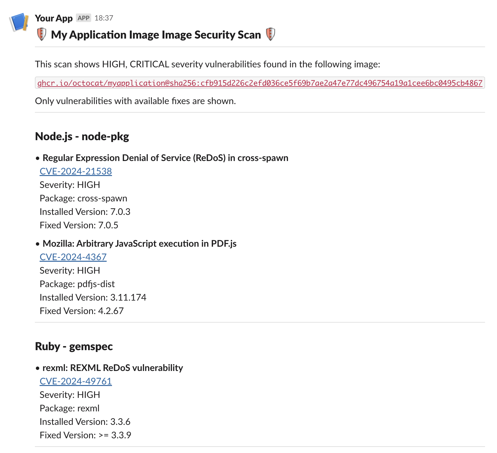

# trivy-image-slack-reporter

**Send a message to Slack with the contents of a Trivy image scan.**

This script takes a Trivy scan JSON file and sends the results to a Slack channel.

If supplied with a GitHub Actions artifact URL, the script will add the link to the full scan results to the Slack message.

The Trivy scan can be done without restrictions on the severity of the vulnerabilities found, as the script can filter the results based on the severity level after the scan is complete.

## Example Slack message



## Required Environment Variables

- RESULTS_FILE: Path to the Trivy scan JSON file
- IMAGE_TITLE: Title of the image being scanned. This does not need to be the full
  name of the image, just a human-readable identifier
- SLACK_BOT_TOKEN: Slack bot token with permission to send messages to the channel
- SLACK_CHANNEL_ID: ID of the Slack channel to send the message to

## Optional Environment Variables

- SEVERITY: Comma-separated list of severity levels to include in the scan results. Defaults to `HIGH,CRITICAL`.
- ARTIFACT_URL: URL to the Trivy scan GitHub Actions artifact

## Example Usage In A GitHub Actions Workflow

```yaml
- name: Run Trivy vulnerability scanner
  uses: aquasecurity/trivy-action@master
  id: trivy-scan
  with:
    image-ref: ${{ inputs.image }}:latest
    format: 'json'
    output: 'trivy-results.json'
    ignore-unfixed: true
    scanners: vuln

- name: Send Results To Slack
  env:
    RESULTS_FILE: trivy-results.json
    IMAGE_TITLE: My Application Image
    SLACK_BOT_TOKEN: ${{ secrets.SLACK_BOT_TOKEN }}
    SLACK_CHANNEL_ID: ${{ secrets.SLACK_CHANNEL_ID }}
  run: python trivy-image-slack-reporter
```
